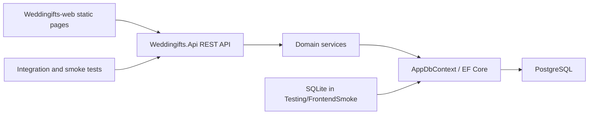

# Architecture

**Pattern:** Layered monolith API with decoupled static multipage frontend.
**Analyzed:** 2026-04-27

## High-Level Structure

The product is split into:

- `Weddingifts-web/`: static frontend pages with one main JavaScript module per page.
- `Weddingifts.Api/`: ASP.NET Core Web API.
- `Weddingifts.Api.IntegrationTests/`: backend integration tests through `WebApplicationFactory`.
- `frontend-smoke/`: Playwright smoke suite that exercises critical browser flows.

## Identified Patterns

### Thin Controllers

**Location:** `Weddingifts.Api/Controllers/*`
**Purpose:** Keep HTTP routing and response shaping separate from domain behavior.
**Implementation:** Controllers read authenticated user id when needed, delegate to services, and map entities to response DTOs.
**Example:** `EventController` delegates create/update/delete/list/public load to `EventService`.

### Services Hold Business Rules

**Location:** `Weddingifts.Api/Services/*`
**Purpose:** Centralize validation, ownership, reservation, RSVP, and time-zone behavior.
**Implementation:** Services use `AppDbContext`, validate inputs, throw semantic exceptions, and persist changes.
**Examples:** `GiftService` protects reservation rules; `EventRsvpService` validates RSVP and companions.

### DTO Boundary

**Location:** `Weddingifts.Api/Models/*`
**Purpose:** Keep HTTP contracts separate from EF entities and avoid leaking sensitive fields.
**Implementation:** Response classes expose `FromEntity` mappers where applicable.

### Frontend Shared Utilities

**Location:** `Weddingifts-web/js/common.js`
**Purpose:** Centralize API base inference, session handling, error parsing, formatting, status messages, and mobile navigation.
**Implementation:** Pages import helpers rather than duplicating auth/session/request behavior.

### Environment-Specific Data Providers

**Location:** `Weddingifts.Api/Program.cs`
**Purpose:** Use PostgreSQL in normal runtime and SQLite for frontend smoke.
**Implementation:** `FrontendSmoke` uses SQLite and recreates the database on startup; `Testing` is overridden by the integration test factory.

## Data Flow

### Authentication

1. `login.html` posts credentials to `POST /api/auth/login`.
2. `AuthService` validates credentials and uses `JwtTokenService`.
3. Frontend stores the response in `localStorage` under `wg_auth_session`.
4. Private pages call `requireAuth()` from `common.js`.
5. Expired sessions are cleared and redirected to `login.html`.

### Event Management

1. Authenticated frontend pages call `/api/events`.
2. `EventController` extracts user id from JWT claims.
3. `EventService` validates ownership, enriched event fields, slug, date/time, and time zone.
4. EF Core persists events and related data.

### Public Invitation Flow, Gifts, and Reservations

1. `event.html?slug={slug}` loads event data from the public slug.
2. The guest enters CPF; RSVP lookup is the guest-specific privacy boundary.
3. Guests without completed invitation flow enter the guided steps: message, RSVP, optional gifts, location/details, and completion.
4. Gift data is loaded lazily by event id when the gift step or direct gift action opens.
5. Reservation and cancellation use gift id plus the CPF already stored from the invitation lookup.
6. The final completion action calls the public completion endpoint and persists completion on `EventGuest`.
7. Completed guests who reopen the link and identify by CPF see direct actions instead of replaying the stepper.
8. `GiftService` requires the CPF to belong to an invited guest for that event.
9. `GiftReservation` keeps historical reserved/unreserved quantities.

### RSVP

1. Public page queries RSVP by event slug and guest CPF.
2. `EventRsvpService` verifies invited guest and status transition rules.
3. Accepted RSVP can include companions up to `maxExtraGuests`.
4. Companion CPF is required only when age on event date is at least 16.
5. Invitation flow completion requires an answered RSVP and is stored as `InvitationFlowCompletedAt`.
6. Administrative event/date/guest changes can reset invalid RSVP state to `pending` and clear invitation completion.

## Code Organization

**Approach:** Layer-based backend and page-based frontend.

**Backend layers:**

- Controllers: HTTP endpoints.
- Services: business logic and validation.
- Models: HTTP request/response contracts.
- Entities: persisted domain model.
- Data: EF Core context and mappings.
- Middleware: global errors and security headers.
- Security: JWT and password hashing.
- Migrations: schema history.

**Frontend organization:**

- One HTML page per user-facing screen.
- One JavaScript module per page under `Weddingifts-web/js/`.
- Shared frontend contracts and helpers in `common.js` and `event-contract.js`.
- One global stylesheet.

## Data Model

Main entities:

- `User`
- `Event` including invitation message metadata.
- `Gift`
- `EventGuest` including RSVP state and invitation completion timestamp.
- `EventGuestCompanion`
- `GiftReservation`

Relationships:

- `User` 1:N `Event`
- `Event` 1:N `Gift`
- `Event` 1:N `EventGuest`
- `Event` 1:N `GiftReservation`
- `EventGuest` 1:N `EventGuestCompanion`
- `Gift` 1:N `GiftReservation`

Important indexes and restrictions:

- `User.Cpf` unique when present.
- `EventGuest(EventId, Cpf)` unique.
- `GiftReservation(GiftId, GuestCpf)` indexed.
- `GiftReservation(EventId, GuestCpf)` indexed.
- Cascades exist for reservations by event/gift and companions by guest.

## Sensitive Areas

- Authentication/session redirects.
- DTO/model contract changes.
- `common.js` shared helpers.
- `styles.css` global responsive behavior.
- Reservation and RSVP business rules.
- Time-zone handling in event and RSVP flows.
- EF model/migration changes.
