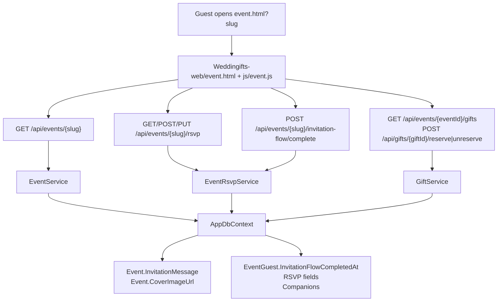

# Fluxo Publico de Aceite de Convite Design

**Spec:** `.specs/features/invitation-acceptance-flow/spec.md`
**Context:** `.specs/features/invitation-acceptance-flow/context.md`
**Status:** Draft - ready for tasks after approval

---

## Design Assumptions

- The request to create this design is treated as approval to proceed from the conflicts captured in `context.md`.
- The implementation stays inside the current layered monolith pattern: controllers are thin, services own rules, DTOs define HTTP contracts, and the frontend remains static HTML/CSS/vanilla JS.
- No frontend framework, router, build step, payment provider, upload service, e-mail, WhatsApp delivery, or per-guest invite token will be introduced.
- `coverImageUrl` becomes optional at the contract/validation level but remains stored as an empty string when absent.
- `InvitationFlowCompletedAt` represents the current valid completion state. When existing RSVP reset rules move a guest back to `pending`, the completion timestamp must be cleared too.
- The existing rule that `declined` RSVP clears companions and dietary restrictions is preserved.
- Direct RSVP editing must preserve companions when the guest remains `accepted`; this is a frontend payload responsibility because the current RSVP PUT contract replaces the companion list.

---

## Architecture Overview

The feature extends the existing public event flow rather than adding a new public page. `event.html` remains the entry point by slug, `event.js` becomes a small state machine for the invitation flow, and existing RSVP/gift endpoints continue to carry most guest actions. The only new public endpoint is completion of the invitation flow.



### Runtime Flow

1. `event.js` reads `slug` from the query string.
2. If no slug exists, the page renders a missing-link fallback, not a primary slug input.
3. The page loads event details from `GET /api/events/{slug}`.
4. Step 1 asks for CPF and calls `GET /api/events/{slug}/rsvp?guestCpf={cpf}`.
5. If `hasCompletedInvitationFlow=true`, render return-menu actions.
6. If not completed, render the 5-step flow.
7. Step 3 submits RSVP through existing POST/PUT semantics.
8. Step 4 loads/reserves gifts through existing gift APIs using the already entered CPF.
9. Step 5 calls `POST /api/events/{slug}/invitation-flow/complete`.

---

## Code Reuse Analysis

### Existing Components to Leverage

| Component | Location | How to Use |
| --- | --- | --- |
| Public event page | `Weddingifts-web/event.html` | Keep the page entry point and replace the current loose slug/RSVP/gift layout with a guided flow container. |
| Public event logic | `Weddingifts-web/js/event.js` | Reuse CPF formatting/validation, RSVP submit logic, companion validation, gift reservation helpers, event header rendering, and error handling patterns. |
| Frontend API utilities | `Weddingifts-web/js/common.js` | Continue using `getApiBase`, `requestJson`, `setStatus`, formatting helpers, and header/session utilities. |
| Event contract utilities | `Weddingifts-web/js/event-contract.js` | Extend enriched event payload parsing/validation for `invitationMessage` and optional `coverImageUrl`. |
| Event controller/service | `Weddingifts.Api/Controllers/EventController.cs`, `Weddingifts.Api/Services/EventService.cs` | Extend create/update/public response contracts for invitation message and optional cover URL. |
| RSVP controller/service | `Weddingifts.Api/Controllers/EventRsvpController.cs`, `Weddingifts.Api/Services/EventRsvpService.cs` | Reuse invited-CPF loading, RSVP status rules, companion validation, reset logic, and response DTO mapping. |
| Gift reservation service | `Weddingifts.Api/Services/GiftService.cs` | Reuse existing invited-CPF gift reservation and cancellation rules. |
| EF context | `Weddingifts.Api/Data/AppDbContext.cs` | Add mapping for new columns and preserve existing relationships/indexes. |
| Integration tests | `Weddingifts.Api.IntegrationTests/*` | Extend Event and RSVP integration contracts instead of creating a separate test style. |
| Frontend smoke | `frontend-smoke/weddingifts.smoke.spec.js`, `frontend-smoke/support/api-helpers.js` | Replace old public page selectors with invitation-flow selectors and add helper coverage for the new endpoint. |

### Fragile Areas and Mitigations

| Concern | Risk | Design Mitigation |
| --- | --- | --- |
| DTO/model contract changes | Frontend and tests may silently drift. | Update request/response contracts, integration contracts, smoke helpers, and frontend parsing in the same implementation slice. |
| RSVP and reservation rules | Companion loss, invalid RSVP transitions, invited CPF leaks. | Keep RSVP rules in `EventRsvpService`; do not duplicate backend validation in new service code. Frontend only improves UX. |
| EF model/migration changes | Runtime schema mismatch. | Add a focused migration for only `Events.InvitationMessage` and `EventGuests.InvitationFlowCompletedAt`; verify with integration tests. |
| Global CSS and mobile layout | Public flow can overflow or fixed button can cover content. | Add scoped public invitation classes and reserve bottom padding for fixed mobile action. Keep global changes minimal. |
| Smoke tests | Current selectors target old public structure. | Introduce stable IDs/data attributes for flow steps, return menu, and gift filters. |

---

## Backend Design

### Data Model Changes

#### `Event`

```csharp
public string InvitationMessage { get; set; } = string.Empty;
```

- Persist as non-null string with default empty value.
- Configure max length as 500 to match existing RSVP message and ceremony-style text limits.
- Empty string means "use frontend fallback copy".
- This field is independent of enriched payload detection. Sending only `invitationMessage` must not force enriched-event validation by itself.

#### `EventGuest`

```csharp
public DateTime? InvitationFlowCompletedAt { get; set; }
```

- Nullable timestamp in UTC.
- Set only by the public invitation completion endpoint.
- Cleared when `EventRsvpService.ResetGuestToPending(...)` resets RSVP due to administrative date/time or `maxExtraGuests` changes.
- Not changed by normal direct RSVP edits unless the guest is reset to pending.

### EF Configuration and Migration

Add one migration that:

- Adds `Events.InvitationMessage` as required/non-null with max length 500 and default `""`.
- Adds `EventGuests.InvitationFlowCompletedAt` as nullable.
- Updates the model snapshot.

`CoverImageUrl` does not need a nullable schema change. It can stay required/non-null because absence is represented by an empty string.

### Request/Response Contracts

#### `CreateEventRequest`

Add:

```csharp
public string? InvitationMessage { get; set; }
```

Existing `CoverImageUrl` remains `string?`, but validation changes from required URL to optional URL.

#### `UpdateEventRequest`

Add:

```csharp
public string? InvitationMessage { get; set; }
```

`InvitationMessage` should be normalized and applied in both legacy and enriched update paths after ownership validation.

#### `EventResponse`

Add:

```csharp
public string InvitationMessage { get; init; } = string.Empty;
```

Map directly from `Event.InvitationMessage`; do not inject fallback copy in the API.

#### `EventGuestRsvpResponse`

Add:

```csharp
public bool HasCompletedInvitationFlow { get; init; }
public DateTime? InvitationFlowCompletedAt { get; init; }
```

Mapping:

```csharp
HasCompletedInvitationFlow = guest.InvitationFlowCompletedAt.HasValue;
InvitationFlowCompletedAt = guest.InvitationFlowCompletedAt;
```

Because RSVP reset clears `InvitationFlowCompletedAt`, the boolean can remain a direct timestamp check.

#### `CompleteInvitationFlowRequest`

Create:

```csharp
public sealed class CompleteInvitationFlowRequest
{
    public string GuestCpf { get; set; } = string.Empty;
}
```

### Completion Endpoint

Add to `EventRsvpController` to keep public invitation/RSVP guest state in one controller/service pair:

```http
POST /api/events/{slug}/invitation-flow/complete
Content-Type: application/json

{ "guestCpf": "00000000000" }
```

Response: `200 OK` with `EventGuestRsvpResponse`.

Service method:

```csharp
Task<EventGuestRsvpResponse> CompleteInvitationFlowAsync(
    string slug,
    CompleteInvitationFlowRequest request)
```

Rules:

1. Normalize and validate slug using the existing safe-text pattern.
2. Normalize and validate CPF using existing `EventGuestService.NormalizeCpf`.
3. Load event by slug and guest by event/CPF with companions.
4. If guest is missing, throw the existing "CPF not invited" validation message.
5. If `RsvpStatus` is `Pending`, throw a validation error: completion requires an answered RSVP.
6. If `InvitationFlowCompletedAt` is null, set it to `DateTime.UtcNow` and save.
7. If it is already populated, keep the timestamp and return the current response.

### Event Validation Changes

Add helper behavior in `EventService`:

```csharp
NormalizeOptionalText(value, fieldLabel, maxLength): string
NormalizeOptionalUrl(value, fieldLabel): string
```

Use cases:

- `InvitationMessage`: optional safe text, max 500, persisted as `""` if missing/blank.
- `CoverImageUrl`: optional URL, max 500, persisted as `""` if missing/blank; non-empty must be absolute HTTP/HTTPS.

`HasEnrichedEventPayload(...)` should keep ignoring blank `coverImageUrl` and should not include `invitationMessage` as a trigger for enriched payload validation.

### RSVP Reset Changes

Extend `ResetGuestToPending(EventGuest guest)`:

```csharp
guest.InvitationFlowCompletedAt = null;
```

This keeps return-menu behavior aligned with current RSVP validity. A guest whose RSVP was administratively reset must answer the current RSVP and complete the invitation again.

---

## Frontend Design

### Page Structure

Keep `event.html` as the public route. Replace the current primary slug/RSVP/gifts sections with:

- Event loading/fallback container.
- Invitation shell container.
- Step indicator.
- Step content region.
- Persistent advance action region.
- Return-menu region.
- Gift card template or reusable gift card markup.

Recommended stable selectors:

| Element | Selector |
| --- | --- |
| Root | `#invitation-flow-root` |
| Status | `#invitation-flow-status` |
| CPF input | `#invitation-guest-cpf-input` |
| Step container | `#invitation-step-panel` |
| Advance action | `#invitation-next-button` |
| Return menu | `#invitation-return-menu` |
| Gift search | `#gift-search-input` |
| Gift filter | `[data-gift-filter]` |
| Gift sort | `#gift-sort-select` |
| Complete action | `#invitation-complete-button` |

### State Model

`event.js` should move from loose independent sections to explicit page state:

```javascript
const FLOW_STEPS = ["identify", "message", "rsvp", "gifts", "location"];

const state = {
  event: null,
  gifts: [],
  giftsLoaded: false,
  rsvp: null,
  guestCpf: "",
  currentStep: "identify",
  mode: "loading", // loading | missingSlug | flow | returnMenu | directGift | directInfo | directRsvp | complete
  giftQuery: "",
  giftFilter: "all",
  giftSort: "availability",
  actionGiftId: null,
  loading: false,
  rsvpSubmitting: false,
  completing: false
};
```

### Main Functions

| Function | Purpose |
| --- | --- |
| `initializeInvitationPage()` | Parse query slug, load event, render missing-link fallback or identify step. |
| `loadPublicEvent(slug)` | Call `GET /api/events/{slug}` and store event. |
| `submitGuestCpf()` | Validate CPF, call RSVP lookup, decide flow vs return menu. |
| `renderInvitationShell()` | Render event heading, stepper/menu container, and action surface. |
| `renderCurrentStep()` | Render one of the five initial flow steps. |
| `advanceInvitationFlow()` | Route the primary next button behavior by current step. |
| `submitRsvpFromFlow()` | Build RSVP payload and call POST/PUT depending on current RSVP status. |
| `ensureGiftsLoaded()` | Lazy-load gifts from `GET /api/events/{eventId}/gifts`. |
| `renderGiftStep()` | Render search/filter/sort, cards, reserve/cancel actions, and skip affordance. |
| `completeInvitationFlow()` | Call the new completion endpoint and render final success state. |
| `renderReturnMenu()` | Render direct actions for completed guests. |
| `openDirectAction(action)` | Switch to direct gift/info/RSVP mode without losing CPF. |

### Step Behavior

| Step | Content | Primary Action |
| --- | --- | --- |
| `identify` | "Você foi convidado para o evento {nome}", date/time, couple names, CPF input. | Validate CPF and call RSVP lookup. |
| `message` | `event.invitationMessage` or fallback message. Optional cover background if URL exists. | Continue to RSVP. |
| `rsvp` | Accepted/declined controls, optional message, dietary restrictions, companions up to `maxExtraGuests`. | Save RSVP and continue. |
| `gifts` | Search/filter/sort, availability, reserve/cancel by stored CPF. | Continue without requiring reservation. |
| `location` | Location, address, Maps link, ceremony info, dress code, date/time, "Esperamos você lá." | Complete invitation flow. |

### Return Menu Behavior

After CPF lookup:

- If `rsvp.hasCompletedInvitationFlow === true`, set `mode="returnMenu"`.
- Show direct actions:
  - "Presentear casal" -> `mode="directGift"` and load gift list.
  - "Informações do evento" -> `mode="directInfo"`.
  - "Adicionar/editar convidados extras" -> `mode="directRsvp"` focused on accepted companion editing.
  - "Confirmar/cancelar presença" -> `mode="directRsvp"` focused on status controls.
- Keep `state.guestCpf` as the single source for reservation/RSVP requests.

### RSVP Payload Safety

The current backend replaces companions on accepted RSVP updates. Therefore:

- The RSVP form must hydrate companion fields from `state.rsvp.companions`.
- When status remains `accepted`, the frontend must submit the currently hydrated companion list.
- It must submit `companions: []` only when the guest explicitly sets companion count to 0 or changes status to `declined`.
- Direct status review must not build a blank accepted payload from an unrendered companion form.

### Gift Search, Filter, and Sort

Keep filtering client-side over loaded gifts.

Minimum controls:

- Search by name and description.
- Filter: all, available, reserved.
- Sort:
  - Availability first.
  - Price ascending.
  - Price descending.
  - Name ascending.

Reservation and cancellation still call existing APIs and refresh gifts after success.

### Event Message and Cover Image

- `event.invitationMessage?.trim()` drives step 2 copy.
- If blank, use the spec fallback copy in frontend.
- If `event.coverImageUrl` is blank, render no image/background and no broken image element.
- If non-empty, use it as a visual background/cover element for the invitation shell or message step, with normal image failure tolerance.

### Private Event UI

Update only the event create/edit surfaces needed for the new contract:

- `create-event.html`: add optional textarea for invitation message; remove `required` from cover image URL.
- `js/create-event.js` and `js/event-contract.js`: read/build/validate `invitationMessage`; validate cover only when non-empty.
- `js/my-events.js`: include invitation message in edit form and update payload; remove required cover validation.
- Event summaries may display invitation message only where useful; do not redesign private pages beyond contract support.

### CSS Approach

Use scoped classes for the public flow to reduce global regressions:

- `.invitation-flow`
- `.invitation-stepper`
- `.invitation-step-panel`
- `.invitation-action-rail`
- `.invitation-fixed-action`
- `.invitation-return-menu`
- `.gift-flow-toolbar`

Mobile rules:

- Reserve bottom padding in the page when the fixed action is visible.
- Keep the fixed action inside the safe content width and above browser bottom UI.
- Do not cover validation/status messages; on RSVP and companion forms, scroll the active field into view after validation errors.
- Use existing button/form styles where possible.

---

## Error Handling Strategy

| Error Scenario | Backend Handling | Frontend Handling |
| --- | --- | --- |
| Missing slug | No API call required. | Render missing/invalid invitation link state. |
| Invalid event slug | Existing event lookup returns not found/validation. | Show PT-BR public error and no CPF flow. |
| Invalid CPF | Existing CPF normalization throws validation. | Pre-validate format and show inline status before request when possible. |
| CPF not invited | Existing validation message from RSVP/gift service. | Show error without rendering guest data. |
| RSVP pending on completion | New completion method throws validation. | Keep or return guest to RSVP step. |
| Gift fully reserved | Existing gift service validation. | Refresh gifts and show reservation error. |
| Empty gift results after filters | No backend error. | Show empty state and keep skip/continue action. |
| Empty cover image URL | Backend persists `""`. | Render no image/background. |
| Invalid non-empty cover image URL | Backend and frontend validation. | Show event-form validation in private UI. |
| RSVP reset after admin change | Existing reset flow plus clear completion timestamp. | On next CPF lookup, start guided flow again. |

---

## Testing Design

### Backend Integration

Extend existing integration test style.

Recommended files:

- `Weddingifts.Api.IntegrationTests/EventIntegrationTests.cs`
- `Weddingifts.Api.IntegrationTests/EventRsvpIntegrationTests.cs`
- `Weddingifts.Api.IntegrationTests/IntegrationTestBase.cs`

Coverage:

- Create event with `invitationMessage` returns it.
- Update event with `invitationMessage` returns it.
- Create rich event without `coverImageUrl` returns `coverImageUrl=""`.
- Update rich event with blank `coverImageUrl` returns `coverImageUrl=""`.
- RSVP lookup before completion returns `hasCompletedInvitationFlow=false`.
- Completion blocks invalid/not-invited CPF.
- Completion blocks pending RSVP.
- Completion succeeds after accepted RSVP.
- Completion succeeds after declined RSVP.
- Completion is idempotent for already completed current RSVP.
- Administrative RSVP reset clears `InvitationFlowCompletedAt` and later lookup returns `hasCompletedInvitationFlow=false`.

### Frontend Smoke

Update `frontend-smoke/weddingifts.smoke.spec.js` and `frontend-smoke/support/api-helpers.js`.

Coverage:

- Create event UI can omit cover image URL and include invitation message.
- Full public flow with invited CPF, RSVP accepted, optional no-gift skip, and completion.
- Full public flow with a gift reservation in step 4.
- Reopen same link, enter CPF, and see return menu.
- Direct "Presentear casal" can reserve using stored CPF.
- Direct RSVP action preserves accepted companions unless explicitly changed.
- Declined RSVP still clears companions.

### Manual Mobile

Follow `.specs/codebase/MOBILE_TESTING.md` with special focus on:

- Fixed lower-right action.
- CPF input with keyboard open.
- RSVP accepted/declined controls.
- Companion count and companion CPF helper text.
- Gift search/filter/sort and reserve/cancel buttons.
- Location/details step.
- No horizontal overflow.

### Gate Checks

Documentation-only design gate for this change:

```powershell
rg --files -u -g '*.md'
git status --short
```

Implementation gate later:

```powershell
dotnet build Weddingifts.Api/Weddingifts.Api.sln
dotnet test Weddingifts.Api/Weddingifts.Api.sln
cmd /c npm run test:frontend-smoke
```

Manual mobile validation remains required because the codebase does not yet have automated mobile viewport coverage.

---

## Requirement Coverage

| Requirement | Design Coverage |
| --- | --- |
| IAF-01 Identify Invited Guest | Public page state machine, CPF lookup, missing slug fallback. |
| IAF-02 Guided Five-Step Invitation Flow | Step model and step behavior table. |
| IAF-03 RSVP and Companions Inside Flow | RSVP service reuse and payload safety rules. |
| IAF-04 Complete Invitation Flow | New completion endpoint and timestamp model. |
| IAF-05 Return Menu After Completion | Return menu mode and direct action routing. |
| IAF-06 Optional Gift Reservation | Gift step uses existing APIs and skip progression. |
| IAF-07 Invitation Message and Optional Cover Image | Event model/DTO/service/frontend contract changes. |
| IAF-08 Gift Search, Filters, and Sorting | Client-side gift toolbar design. |
| IAF-09 Public Contract and Migration Coverage | EF migration, DTOs, backend integration, smoke updates. |

---

## Tech Decisions

| Decision | Choice | Rationale |
| --- | --- | --- |
| Completion service placement | Add `CompleteInvitationFlowAsync` to `EventRsvpService` and route from `EventRsvpController`. | Reuses invited CPF, RSVP status, companion loading, and response mapping without duplicating guest-state rules. |
| Completion endpoint response | Return `EventGuestRsvpResponse`. | Lets frontend update return-menu state without an extra RSVP lookup. |
| Completion validity after RSVP reset | Clear `InvitationFlowCompletedAt` when resetting guest to `pending`. | Keeps "completed" aligned with current valid RSVP state and avoids stale return menus. |
| Cover image storage | Keep non-null string, use `""` for absence. | Matches existing entity style and avoids unnecessary nullable migration complexity. |
| Invitation message fallback | Frontend fallback, backend returns persisted value. | Keeps API contract literal and allows copy changes without data migration. |
| Gift filtering | Client-side over loaded gift list. | Existing public gift list already loads all gifts; no backend filtering contract needed. |
| Frontend architecture | One stateful `event.js` module, no new framework. | Preserves current static multipage architecture. |

---

## Deferred Design Notes

- If product later requires historical invitation completions, add an audit table instead of overloading `InvitationFlowCompletedAt`.
- If gifts become large enough to affect public page performance, introduce backend query parameters for search/filter/sort.
- If per-guest links are added later, the CPF identification step can become optional when a signed guest token is present.
- If mobile regression risk grows, add Playwright mobile viewport tests as a separate feature.
